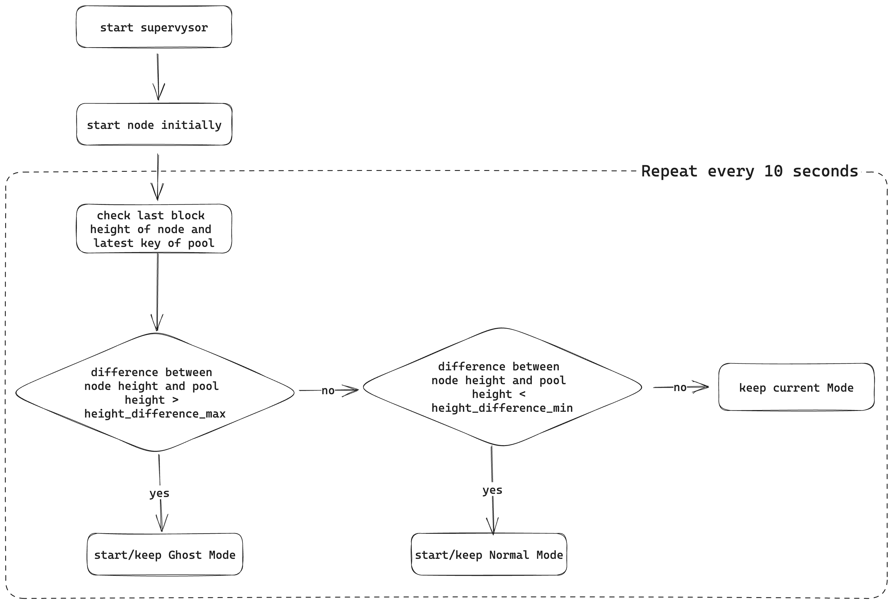

<div align="center">
  <h1>@supervysor</h1>
</div>


## Content

- [What is the supervysor?](#what-is-the-supervysor)
- [How does it work?](#how-does-it-work)
- [Requirements](#requirements)
- [Installation](#installation)
- [Usage](#usage)
- [Examples](#examples)

## What is the supervysor?

Participating in a KYVE data pool such as Cosmoshub or Osmosis requires running two nodes: the KYVE protocol node and the data source node (e.g., full node of Cosmoshub, Osmosis, etc.). However, running these full nodes in parallel can result in high storage requirements (approximately 10TB for Osmosis), leading to increased operational costs and inefficient resource utilization. This inefficiency arises because the node begins synchronizing from the start, even though it only requires storage for a certain range of blocks. Additionally, the node lacks information about the progress of the KYVE pool and the already validated data, making pruning impractical when running a node as a KYVE data source.

However, if the synchronization process is halted, the node cannot fulfill its responsibilities as data source effectively. To overcome this challenge, the supervysor is introduced as a solution. The supervysor manages the data source node process based on the requirements of a KYVE data pool. It ensures that the node synchronizes only up to the necessary extent and continues to provide data even when the synchronization process is paused.

By implementing the supervysor, the synchronization process is optimized, reducing unnecessary storage usage and operational costs. The node can focus on synchronizing up to the required point, thus efficiently utilizing resources while fulfilling its role as a data source for the KYVE pool.

## How does it work?

### Structure

The supervysor is a process manager that is wrapped around a Tendermint node or the Cosmovisor. After the initial start, the node-height and the pool-height of the KYVE data pool are queried at a specified interval, after which the difference between the two values is calculated. If the difference is higher than ```height_difference_max``` , the node is set to the `Ghost Mode`. In this mode, the synchronization process is stopped by making the address book inaccessible and by starting the node without seeds and with a modified laddr. This ensures that the node cannot reach other peers and thus cannot synchronize new blocks. If the difference is smaller than ```height_difference_min```, the address book is made accessible again and the node is started with specified seeds so that peers can be found and the synchronization process can continue. If the difference is smaller than ```height_difference_max``` and larger than ```height_difference_min``` the current mode is kept. In both modes, the endpoints are accessible to the protocol node, so the required data remains accessible even if the node does not synchronize.

<p align="center">
  
</p>

To keep memory requirements as low as possible, we need to specify both a maximum value for how far the data source node can synchronize beyond the current pool height and the matching pruning settings to make sure that data can only be pruned after validation. Derived from this, these values were calculated as followed:

* `height_difference_max = max_bundle_size / upload_interval * 60 * 60 * 24 * 2` (maximum bundles for 2 days)
* `height_difference_min = height_difference_max / 2` (maximum bundles for 1 day)

These values ensure that
* the data source node will always be 1 day ahead to the latest pool-height,
* the data source node will not sync to the latest height, because it will stop syncing when the required blocks for the next 2 days are stored locally,
* the data source node has a time window of 1 day to connect to peers to continue syncing before the pool catches up.

### Pruning

Aside from the optimized syncing process, pruning already validated data is the second role of the supervysor to fulfill its goal of reducing disk storage requirements. Therefore, a custom pruning method is used, which relies on the provided Tendermint functionality of pruning all blocks until a specified height. In the context of the supervysor, this until-height should always be lower than the latest validated height of the KYVE data pool to ensure no data is pruned that needs validation. Unfortunately, the node has to be stopped to execute the pruning process, while a pruning-interval needs specification in hours. During this interval, the supervysor halts the current node process, prunes all validated blocks, and restarts the node. Due to the required time to connect with peers and to prevent the pool from catching up with the node, the pruning process is only initiated if the node is in GhostMode. If the node is in NormalMode, even if the interval reaches the pruning threshold, pruning will be enabled immediately after the node enters GhostMode. Additionally, it is recommended to set the pruning-interval to a value of at least six hours to ensure there is enough time to find peers before the pool catches up.

## Requirements

The supervysor manages the process of the data source node. First of all, it should be ensured that this node can run successfully, which can be tested by trying to sync the first `n` blocks. In addition, to successfully participate in a KYVE data pool, it is necessary to create a protocol validator and join a data pool. Further information can be found here: https://docs.kyve.network/validators/protocol_nodes/overview

Make sure your Go version is at least ```1.20```.
## Installation

To install the latest version of `supervysor`, run the following command:

```bash
go install github.com/KYVENetwork/supervysor/cmd/supervysor@latest
```

To install a previous version, you can specify the version:

```bash
go install github.com/KYVENetwork/supervysor/cmd/supervysor@v0.1.0
```

_Optional:_ If you have issues to successfully run the `go install` command, make sure to export the following to your environment:

```bash
env GIT_TERMINAL_PROMPT=1
```

Run `supervysor version` to check the installed version.

You can also install from source by pulling the supervysor repository and switching to the correct version and building
as follows:

```bash
git clone git@github.com:KYVENetwork/supervysor.git
cd supervysor
git checkout tags/vx.x.x -b vx.x.x
make supervysor
```

This will build supervysor in `/build` directory. Afterwards you may want to put it into your machine's PATH like
as follows:

```bash
cp build/supervysor ~/go/bin/supervysor
```

## Usage

To use the supervysor, you first need to initialize it:

```bash
supervysor init
--binary              string   'path to chain binaries (e.g. ~/go/bin/osmosisd)'
--chain-id            string   'KYVE chain-id'
--home                string   'path to home directory (e.g. ~/.osmosisd)'
--metrics             string   'exposing Prometheus metrics ("true" or "false")'
--pool-id             int      'KYVE pool-id'
--seeds               string   'seeds for the node to connect'
--pruning-interval    int      'block-pruning interval (hours) (default 24)'
--fallback-endpoints  string   'additional endpoints to query KYVE pool height [optional]'
```

This command creates a config file at ```~/.supervysor/config.toml``` which is editable and required to start the supervysor.

To start the supervysor after the successful initialisation, run the following command:

```bash
supervysor start
```

Then the supervysor starts the chain binaries or cosmovisor to manage the syncing process depending on the required data of the KYVE pool.

## Examples

### 1. Run a Cosmovisor Osmosis node with the supervysor

To run an Osmosis node with the Cosmovisor you have to download and set up the correct binaries. You can see a more detailed
introduction [here](https://docs.osmosis.zone/networks/join-mainnet/).

Verify the correct installation and setup with the successful start of the node syncing ~ 2,000 blocks:

```bash
cosmovisor run start [flags]
```

With your node being able to run using Cosmovisor, you can stop the process and install the supervysor to start optimize this process for KYVE purposes. After the [installation](#installation), you can initialize the supervysor with the following command:

```bash
supervysor init \
--binary '/root/go/bin/cosmovisor' \
--chain-id 'kyve-1' \
--home '/root/.osmosisd' \
--pool-id 1 \
--seeds '6bcdbcfd5d2c6ba58460f10dbcfde58278212833@osmosis.artifact-staking.io:26656,ade4d8bc8cbe014af6ebdf3cb7b1e9ad36f412c0@seeds.polkachu.com:12556'
```

After the successful initialization you can start your node with:

```bash
supervysor start
```

The supervysor then will start an Osmosis node as data source for the pool with the ID 27 of the Korellia network.