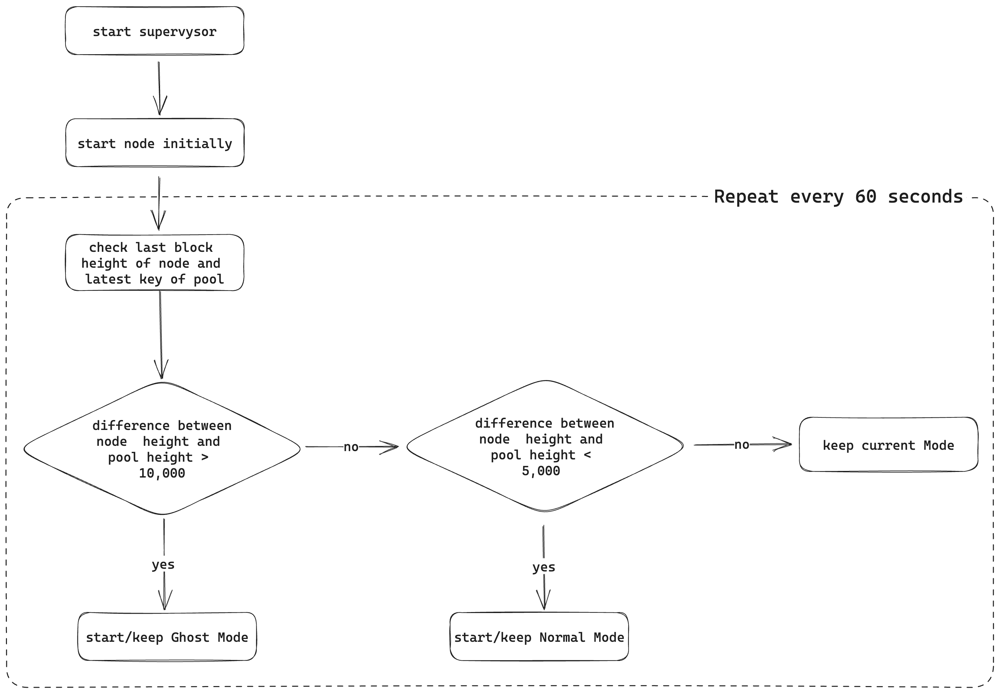

  <h1>@supervysor</h1>

<strong></strong>

## Content

- [What is the supervysor?](#what-is-the-supervysor)
- [How does it work?](#how-does-it-work)
- [Requirements](#requirements)
- [Installation](#installation)
- [Usage](#usage)
- [Examples](#examples)

## What is the supervysor?

To successfully participate in a KYVE data pool such as Cosmoshub or Osmosis, you need to run two nodes: the protocol node (KYVE) and the data source node (full node of Cosmoshub, Osmosis, etc.). In parallel, these full nodes require a lot of storage (~ 10TB for Osmosis), which leads to high operation costs and therefore less efficient funding usage although pruning can be actived. This is due to the fact that after the start, the node immediately begins to synchronize up to the last block, although only the storage of a certain range of blocks is necessary. However, if this synchronization process is stopped, the node cannot fulfill its tasks as a data source. The supervysor solves this problem by managing the state of the node depending on the requirements of the data pool. This ensures that the node synchronizes only as far as needed, while still providing data when the synchronization process stops.

## How does it work?

The supervysor is a process manager that is wrapped around a node or the cosmovisor. After the initial start, the node-height and the pool-height of the KYVE data pool are queried at a specified interval, after which the difference between the two values is calculated. If the difference is higher than height_difference_max, the node is set to the Ghost Mode. In this mode, the synchronization process is stopped by making the address book inaccessible and starting the node without seeds and with a modified laddr. This ensures that the node cannot reach other peers and thus cannot synchronize new blocks. If the difference is smaller than height_difference_min, the address book is made accessible again and the node is started normally so that peers can be found and the synchronization process can continue. If the difference is smaller than height_difference_max and larger than height_difference_min the current mode is kept. In both modes, the endpoints are accessible to the protocol node, so the required data remains accessible even if the node does not synchronize.

  

## Requirements

The supervysor manages the process of the data source node. First of all, it should be ensured that this node can run successfully. In addition, to successfully participate in a KYVE data pool, it is necessary to create a protocol validator and join a data pool. Further information can be found here: https://docs.kyve.network/validators/protocol_nodes/overview

TODO(@christopher): Do I need a specific Go version?

## Installation

TODO(@christopher)

## Usage

TODO(@christopher)

## Examples

TODO(@christopher)